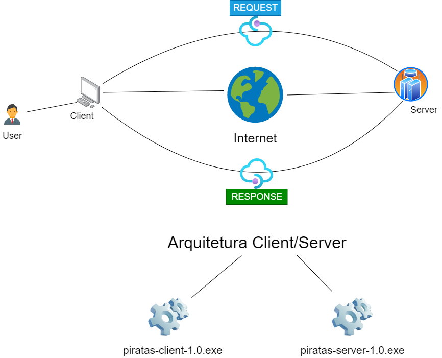

## Piratas-Server

Piratas Server é um chat básico de código aberto para comunicar com os membros e participantes do **Piratas Vix**, ele permite que vários clientes se conectem e proporciona aos usuários comodidade com sua privacidade e segurança em tempo real.
<br><br>



<br>
Versão do cluster escrito em Rust
<br><br>

#### Tutorial

Baixe ou clone o repositório `https://github.com/piratesvix/piratas-server`

<br>

###### Compilar projeto na linguagem Rust

```sh
cargo build
```